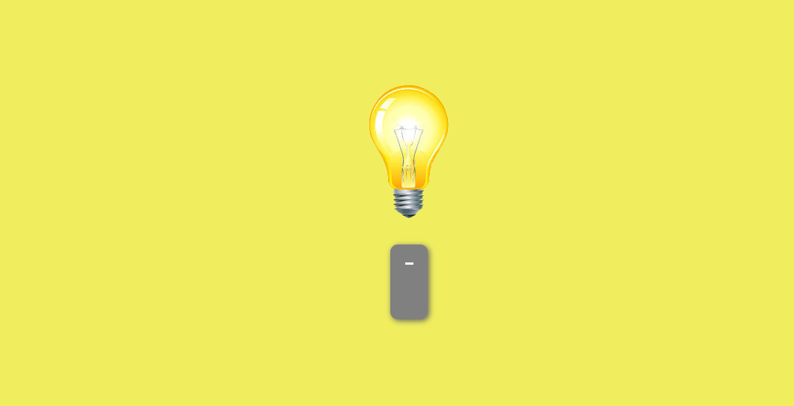

<h1 align='center'>Lampada</h1> 

<p align="center">
   
</p>

> Status do Projeto: :heavy_check_mark: concluído

## Table of contents

- [Overview](#overview)
  - The challenge is to build out this interactive rating component and get it looking as close to the design as possible.
  - My process: It took me 2 days to build this.
  - Built with: HTML5, CSS3 and JAVASCRIPT.
  - What I learned: I've learned how to manipulate a button and background.
  - Continued development: I have to continue practice how to manipulate DOM. 
- Author: Natali Marinho. 
- Deploy: https://natsmarinho.github.io/lampada/

### The challenge

Users should be able to:

- Change the status of the lamp by clicking on the button;
- See the lamp cracked;

### Screenshot




### Built with

- Semantic HTML5 markup
- CSS custom properties
- Flexbox
- -JAVASCRIPT

### What I learned

```js
function interruptor(){
    document.body.classList.toggle('muda-tema')

    cliques++
    if (cliques >= 20){
        let quebrou = document.getElementById('quebrada')
        quebrou.style.display = 'flex'
        document.body.style.backgroundColor = "#1a1818"
        ligada.style.display = 'none'
        desligada.style.display = 'none'
    } else if (estadoLamp == true){
        estadoLamp = false 
        desligada.style.display = 'flex'
        document.body.style.backgroundColor = "#1a1818"
        ligada.style.display = 'none'
    } else {
        estadoLamp = true
        let ligada = document.getElementById('ligada')
        ligada.style.display = 'flex'
        document.body.style.backgroundColor = "#F0EE5F"
        desligada.style.display = 'none'
    }
}

```
### Useful resources

- [Mdn](https://developer.mozilla.org/pt-BR/docs/Web/CSS/box-shadow) - This is an amazing article about box-shadpw. I'd recommend it to anyone still learning this concept.
- [FrontKode](https://youtu.be/EeFtQMNHLM) - This video inspired me for the stylization of my button;


## Author

- Frontend Mentor - [@natsmarinho](https://www.frontendmentor.io/profile/natsmarinho)
- Twitter - [@natsmarinho](https://www.twitter.com/natsmarinho)
- Instagram - [@natsmarinho](https://www.instagram.com/natsmarinho/)
- LinkedIn - [natsmarinho](https://www.linkedin.com/in/natsmarinho/)

## Acknowledgments

Nícolas Gabriel helped me with this project, I am greatful for being his friend and recieve his knowledges. 
